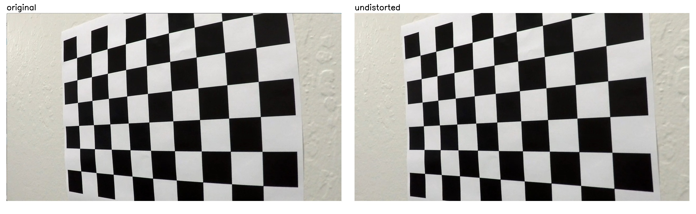
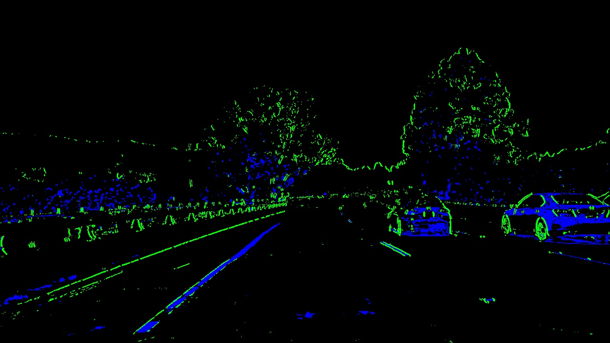
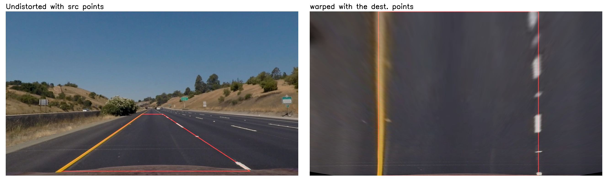

# Advanced Lane Lines Finding

---

The goals / steps of this project are the following:

* Compute the camera calibration matrix and distortion coefficients given a set of chessboard images.
* Apply a distortion correction to raw images.
* Use color transforms, gradients, etc., to create a thresholded binary image.
* Apply a perspective transform to rectify binary image ("birds-eye view").
* Detect lane pixels and fit to find the lane boundary.
* Determine the curvature of the lane and vehicle position with respect to center.
* Warp the detected lane boundaries back onto the original image.
* Output visual display of the lane boundaries and numerical estimation of lane curvature and vehicle position.


## How to run
install conda, and create an environment based on the yml file provided
```bash
conda env create -f environment.yml
```
activate the environment and run the jupyter notebook

```bash
activate carnd-term1
jupyter notebook
```
the project is implemented in the P2.ipynb

---

## Camera Calibration

The code for this step is contained in the first, second, and third code cells of the IPython notebook located in "./P2.ipynb".  

I start by preparing "object points", which will be the (x, y, z) coordinates of the chessboard corners in the world. Here I am assuming the chessboard is fixed on the (x, y) plane at z=0, such that the object points are the same for each calibration image.  Thus, `objp` is just a replicated array of coordinates, and `objpoints` will be appended with a copy of it every time I successfully detect all chessboard corners in a test image.

**The output images of this stage can be found under [this directory](./output_images/CameraCalibration/Corners/)**


[calibration2_corners.jpg](./output_images/CameraCalibration/Corners/calibration2_corners.jpg)

`imgpoints` will be appended with the (x, y) pixel position of each of the corners in the image plane with each successful chessboard detection.  

I then used the output `objpoints` and `imgpoints` to compute the camera calibration and distortion coefficients using the `cv2.calibrateCamera()` function. these are stored in a pickel file named `CameraMatrix_DistrotionCoefficients.pickle`. I applied this distortion correction to the test image using the `cv2.undistort()` function and obtained this result: 

**The output images of this stage can be found under [this directory](./output_images/CameraCalibration/Undistorted/)**


<center>[calibration4_undistorted.jpg](./output_images/CameraCalibration/Undistorted/calibration4_undistorted.jpg)</center>

and, finally if the point to be found on the undistorted image, the image is warped using the corners as the reference points and `cv2.getPerspectiveTransform` function. the warped chessboard is as it seen from the front.

**The output images of this stage can be found under [this directory](./output_images/CameraCalibration/Warped/)**


<center>[calibration3_warped.jpg](./output_images/CameraCalibration/Warped/calibration3_warped.jpg)</center>

## Pipeline overview

the pipeline is defined in the fifth cell of the IPython notebook located in "./P2.ipynb" as the function called `advanced_pipline` in the `RobustLaneLineDetection` class. The `RobustLaneLineDetection` class contains the pipeline, lane line sanity check, and necessary definitions like the instances of the left lane, right lane, and the average of these two called lane. these are instances of the `Line` class. this class holds the memory of the last 10 successful fitted polynomial and x values of the fitted line. also, whether or not the line is detected in last try and number of the total and consecutive failed fits are stored in this class. the main use of this class is in the video process. However, the `RobustLaneLineDetection` and `Line` classes are designed so they can be used for single image as well. simply, for each new image, a new instance of the `RobustLaneLineDetection` should be created.

### 1. Distortion correction

The camera calibration matrix and distortion coefficients obtained during the camera calibration step are passed to the constructor of the lane line detection class. these are used to undistort the image pass to the pipeline since the calibration parameters are independent from the camera angle. like before by using `cv2.undistort()` function, the undistorted image is created:


<center>[test1_stage1_undistorted.jpg](./output_images/test1_stage1_undistorted.jpg)</center>

### 2. Color and gradients transforms

the goal of this stage is used to generate a thresholded binary image using the combination of color and gradient thresholds . 

#### Color transform and color thresholding

Color transform is defined in the `advanced_pipeline` function in the fifth cell of the IPython notebook located in "./P2.ipynb". 
first, the image is converted to the HLS color space. this gives three channels: l-channel, s-channel, h-channel. the s-channel is good at detecting the differece between the light color where l-channel or gray-scale transform loses the information.  minimum 170 and maximum 255 thresholds is applied on the S-channel  and the binary output as follows: (these values are chosen so the lane lines are preserved while the other colors are canceled)


<center>[test1_stage3_clrThrsh.jpg](./output_images/test1_stage3_clrThrsh.jpg)</center>

#### Sobel operator and gradient thresholding

the Sobel operator performs gradient on the l-channel to detect the edges of the objects. The Sobel operator and gradient thresholding are defined in the `abs_sobel_thresh`,`mag_thresh`, and `dir_threshold` functions in the forth cell of the IPython notebook located in "./P2.ipynb". these functions are calculating the sobel operator thresholding over x or y, gradient magnitude thresholding, and gradient direction thresholding respectively. Sobel operator is done by `cv2.Sobel` function which accept the gradient kernel size too. with a larger kernel size the gradient would be smoother.

for the purpose of lane line detection, first sobel operator is calculated over the x axis. this detects the roughly vertical edges in the image. then gradient magnitude and direction are combined, detecting the almost vertical gradients which are large enough. the result of this two operation are added and the output of the gradient thresholding is like the following image:


<center>[straight_lines1_stage2_gradThrsh.jpg](./output_images/straight_lines1_stage2_gradThrsh.jpg)</center>

#### Combinition of the color and gradient thresholding

the following image illustrates how these two complete each other: where color thresholding(in blue) fails to detect the lane line gradient thresholding(in green) finds the lane and vice versa. 


<center>[test4_stage4_clrGradThrsh.jpg](./output_images/test4_stage4_clrGradThrsh.jpg)</center>

the thresholded binary combinition image looks like this:


<center>[test1_stage5_binary_combo.jpg](./output_images/test1_stage5_binary_combo.jpg)</center>

### 3. Perspective transform 

The goal of this stage is to transform the 
The code for my perspective transform includes a function called `unwarp()`, which appears in the [first code cell](./P2.ipynb#Helper-functions) of the IPython notebook located in "./P2.ipynb".  The `unwarp()` function takes as inputs an image (`img`), as well as source (`src`) and destination (`dst`) points.  I chose the hardcode the source and destination points in the following manner:


| Source        | Destination   | 
|:-------------:|:-------------:| 
| 229, 700      | 300, 720      | 
| 595, 450      | 300, 0        |
| 1068, 700     | 1000, 720     |
| 687, 450      | 1000, 0       |

I verified that my perspective transform was working as expected by drawing the `src` and `dst` points onto a test image and its warped counterpart to verify that the lines appear parallel in the warped image.


<center>[straight_lines1_stage6_warped_src_dest.jpg](./output_images/straight_lines1_stage6_warped_src_dest.jpg)</center>

### 4. Describe how (and identify where in your code) you identified lane-line pixels and fit their positions with a polynomial?

Then I did some other stuff and fit my lane lines with a 2nd order polynomial kinda like this:


### 5. Describe how (and identify where in your code) you calculated the radius of curvature of the lane and the position of the vehicle with respect to center.

I did this in lines # through # in my code in `my_other_file.py`

### 6. Provide an example image of your result plotted back down onto the road such that the lane area is identified clearly.

I implemented this step in lines # through # in my code in `yet_another_file.py` in the function `map_lane()`.  Here is an example of my result on a test image:


---

## Pipeline (video)

### 1. Provide a link to your final video output.  Your pipeline should perform reasonably well on the entire project video (wobbly lines are ok but no catastrophic failures that would cause the car to drive off the road!).

Here's a [link to my video result](./project_video.mp4)
<video src="./project_video_output.mp4" width="960" height="540" controls/>
---

## Discussion

### 1. Briefly discuss any problems / issues you faced in your implementation of this project.  Where will your pipeline likely fail?  What could you do to make it more robust?

Here I'll talk about the approach I took, what techniques I used, what worked and why, where the pipeline might fail and how I might improve it if I were going to pursue this project further. 
slow, 
hills or sudden movements
not all pixels lane line in the bird eye view


```python

```
